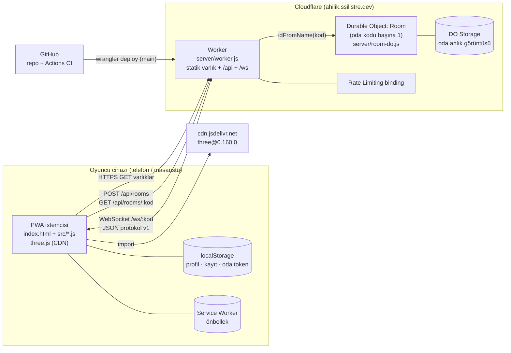
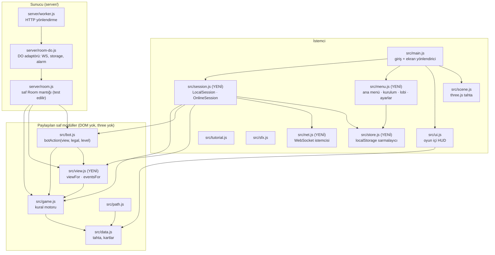
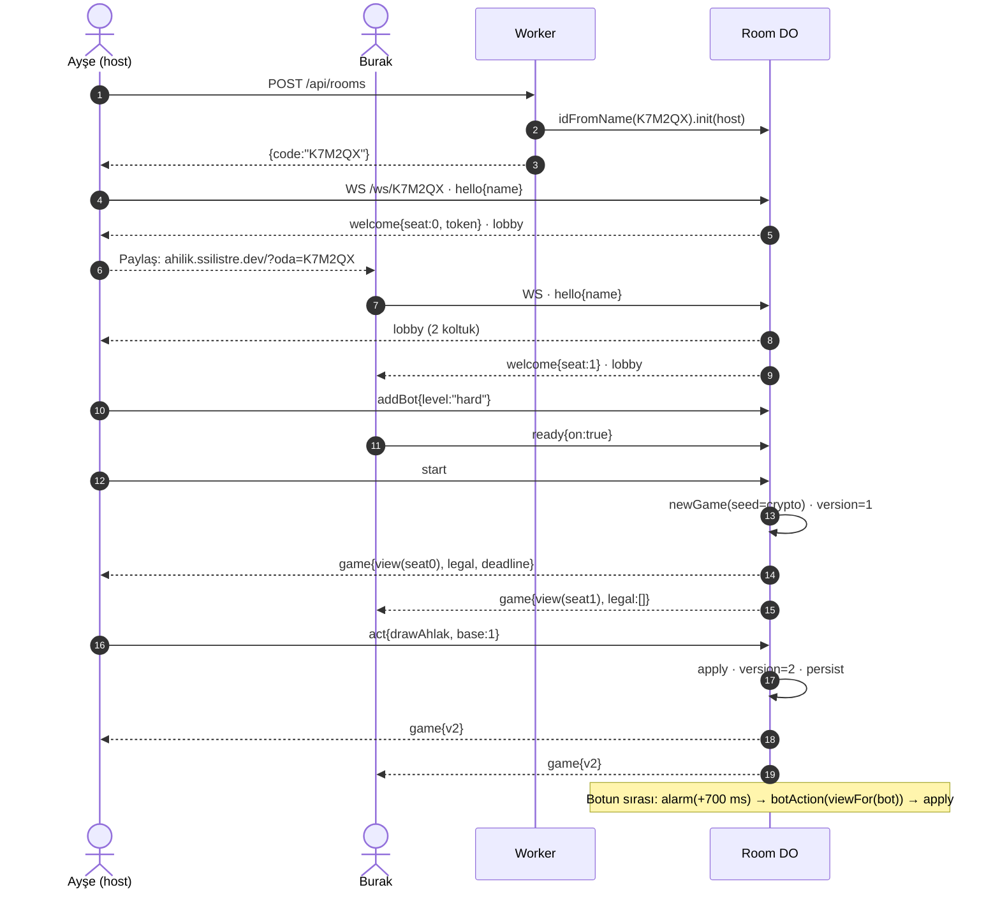
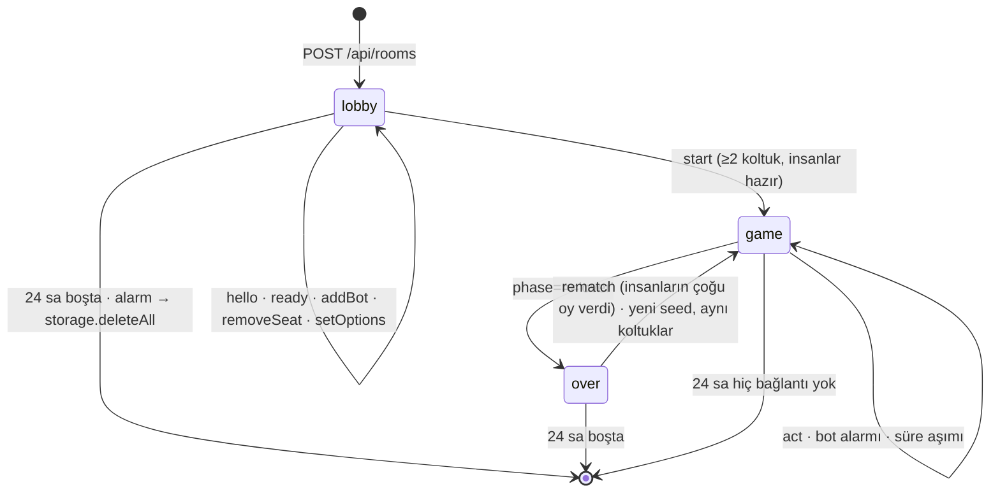
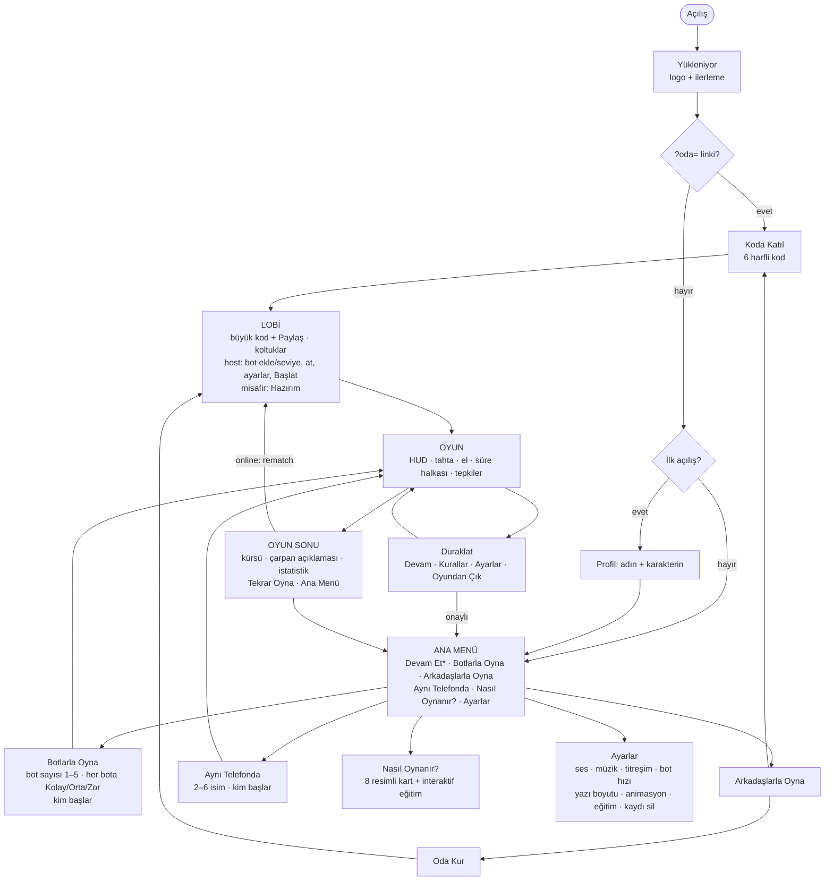
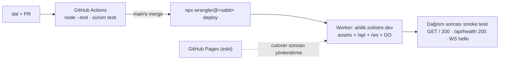

# Ahilik Yolu — Sistem Mimarisi (v5: çevrimiçi + menü + bot seviyeleri)

Durum: **taslak, onay bekliyor (AHI issue: "Mimari onayı")**. Tarih: 2026-10-10.
Bu belge `SPEC.md` ile birlikte okunur. Kural davranışı SPEC'tedir; burası sistemin parçalarını, aralarındaki sözleşmeleri ve dağıtımı anlatır.

## 1. Hedefler ve sınırlar

**Hedefler**
- Oyun dört modda oynanabilir:
  1. Botlarla (çevrimdışı).
  2. Aynı telefonda (cihazı elden ele vererek).
  3. Arkadaşlarla, **davet koduyla** (çevrimiçi).
  4. Çevrimiçi odada boş koltuklara bot eklenerek (karma).
- Bot zorluğu: **Kolay / Orta / Zor**. Botlar yalnız kendi görebildiği bilgiyle (view) karar verir.
- Kural motoru tektir. `src/game.js` hem tarayıcıda hem sunucuda **aynı dosya** olarak çalışır.
- Çocuk güvenliği:
  - Hesap yok.
  - Serbest sohbet yok, yalnız hazır tepkiler (emote) var.
  - Kişisel veri toplanmaz.
  - Odalar 24 saat sonra silinir.

**Sınırlar (bilinçli olarak yapılmayanlar, YAGNI)**
- Hesap/giriş, arkadaş listesi, eşleştirme (matchmaking), sıralama tablosu, izleyici modu, sohbet, çoklu dil.
- Veritabanı. Oda durumu Durable Object storage'da yaşar ve oda kapanınca silinir.
- Bundler ve npm runtime bağımlılığı. İstemci build'siz kalır. Sunucuyu `wrangler` paketler; wrangler yalnız geliştirme aracıdır ve `npx` ile sabit sürümle çalışır.

## 2. Sistem bağlamı



## 3. Modül haritası



Kurallar:
- `server/room.js` saftır. Saat (`now`) ve rastgelelik (`rand`) parametre olarak gelir. `node:test` ile tarayıcısız ve wrangler'sız test edilir.
- `server/room-do.js` ince bir adaptördür: WebSocket, storage ve alarm. İçinde oyun mantığı olmaz.
- İstemcide `main.js` motoru doğrudan çağırmaz, yalnız `Session` arayüzünü bilir. İki uygulama vardır (Local, Online); bu yüzden arayüz gerekçelidir.

## 4. Session arayüzü (istemci)

```js
// src/session.js
// İki uygulama: LocalSession (bugünkü main.js davranışı) ve OnlineSession (net.js üzerinden).
session = {
  mode: 'local' | 'online',
  you: seat | null,            // online: kendi koltuğun; local: null (aktif insan)
  act(action),                 // local: apply + bot zamanlayıcı; online: {t:'act'} gönderir
  onUpdate(cb),                // cb({ view, legal, events, meta })
  undo?(),                     // yalnız local
  leave(),
}
meta = { conn: 'ok'|'reconnecting'|'lost', deadline: epochMs|null, seats: [...lobi bilgisi] }
```

- UI ve scene, `state` yerine **view** alır. View, state ile aynı şekildedir; gizli alanların içi boşaltılmıştır (§6). Mevcut UI kodu `hand.length` ve `seed` dışında gizli alana dokunmadığı için değişiklik küçüktür.
- Local modda view, aktif insanın gözünden üretilir. Aynı cihazda çok insan varsa perde mantığı korunur.

## 5. Ağ protokolü v1 (WebSocket, JSON)

Her mesaj `{ v:1, t:<tip>, ... }` biçimindedir. En büyük mesaj 8 KB'tır. Saniyede en çok 20 mesaj kabul edilir. Aşan bağlantı `error{code:'rate'}` alır ve kapatılır.

**İstemci → sunucu**

| t | alanlar | kim | açıklama |
|---|---|---|---|
| `hello` | `token?`, `name`, `avatar` | herkes | Bağlanınca ilk mesaj. Token varsa aynı koltuğa döner. |
| `ready` | `on:bool` | insan | Lobide hazır olma. |
| `addBot` | `level:'easy'\|'medium'\|'hard'` | host | Boş koltuğa bot ekler. |
| `setBot` | `seat`, `level` | host | Botun seviyesini değiştirir. |
| `removeSeat` | `seat` | host | Botu çıkarır ya da insanı atar (kick). |
| `setOptions` | `turnSeconds:0\|30\|60\|120`, `startSeat:'youngest'\|seat` | host | Oda ayarları. |
| `start` | – | host | En az 2 koltuk dolu ve tüm insanlar hazırsa oyunu başlatır. |
| `act` | `action`, `base:version` | actor | Oyun aksiyonu. `base` eskiyse reddedilir. |
| `emote` | `id` (hazır listeden) | oyuncu | Hazır tepki; serbest metin yok. |
| `rematch` | – | oyuncu | Oyun bitince tekrar oynama oyu. |
| `ping` | – | herkes | 25 sn'de bir. |

**Sunucu → istemci**

| t | alanlar | açıklama |
|---|---|---|
| `welcome` | `you:{seat, token}`, `code` | Token istemcide `localStorage['ahilik.room.'+code]` içinde saklanır. |
| `lobby` | `seats:[{seat,name,avatar,bot,level,ready,online,host}]`, `options`, `phase:'lobby'\|'game'\|'over'` | Lobi her değiştiğinde gönderilir. |
| `game` | `version`, `view`, `legal`, `events`, `deadline` | Her aksiyondan sonra koltuk başına ayrı hazırlanır. |
| `emote` | `seat`, `id` | Tepki yayını. |
| `error` | `code`, `msg` | Kodlar: `stale`, `illegal`, `notYourTurn`, `full`, `started`, `notFound`, `rate`, `badName`, `version`. |
| `pong` | – | `ping` cevabı. |



## 6. Gizli bilgi: `viewFor` ve `eventsFor` (`src/view.js`)

Sunucu otoriterdir. İstemci hiçbir zaman tam state görmez.

`viewFor(state, seat)` state'in derin kopyasını alır ve şunları yapar:

| Alan | View'da |
|---|---|
| `seed`, `rng` | `seed` → opak `gameId` (oyun başına rastgele dize), `rng` → `0` |
| `players[i].hand` (i ≠ seat) | aynı uzunlukta `null` dizisi |
| `decks.yol`, `decks.ahlak`, `decks.ticaret` | aynı uzunlukta `null` dizisi (sıra gizli) |
| `decks.yolDiscard`, `decks.ahlakDiscard` | açık (masada görünür) |
| `players[i].task` | açık (ticaret kartı kurulumda açık dağıtılır) |
| `pending.trade.give` | yalnız `from` ve `to` için açık, diğerlerine `null` |
| `pending.road.offers[].cards` | açık (masaya konan kartlar) |

`seat = null` view'ı izleyici view'ıdır: hiçbir el görünmez.

`eventsFor(events, seat)` şunları yapar:
- `swap` event'indeki `give`/`want` kart id'leri yalnız iki tarafa açıktır, diğerlerine `null` gider.
- `refill` yalnız sayı taşır (zaten öyle).
- `task` event'indeki yeni görev kartı açıktır.

**Test şartı (değişmez):** Fuzz testi 500 rastgele oyunun her adımında, koltuğun kendi eli dışındaki hiçbir yol kartı id'sinin ve hiçbir deste sırasının `JSON.stringify(viewFor(...))` ve `eventsFor(...)` içinde geçmediğini doğrular.

Botlar da `viewFor(state, botSeat)` + `legalActions(state)` ile karar verir. "Zor" bot hile yapamaz.

## 7. Oda yaşam döngüsü



**Zamanlayıcılar.** DO'da tek alarm vardır, en yakın son tarihe kurulur. Saf `room.tick(now)` vadesi gelen işleri döner:

| Olay | Süre | Ne olur |
|---|---|---|
| Bot sırası | 700 ms (ahlak sonrası 1200 ms) | `botAction(viewFor(bot), legal, level)` uygulanır. |
| Tur süresi (`turnSeconds>0`) | 30/60/120 sn | Süre dolunca o oyuncu için **Orta** bot bir aksiyon oynar. Log satırı: "süre doldu, otomatik oynandı". |
| Cevap süresi (takas/yol katkısı) | 20 sn | Otomatik ret ya da `contribute []`. |
| Kopan bağlantı | 30 sn tolerans | Koltuk "bot devraldı" olur. Oyuncu dönünce koltuğu geri alır. |
| Boşta oda | 24 sa | Storage silinir. |

**Kalıcılık.** Her başarılı mutasyondan sonra `storage.put('room', snapshot)` çalışır. Snapshot `{lobby, state, version, log(son 200), deadlines}` içerir. DO uyanınca snapshot'tan kurulur (WebSocket Hibernation API).

**Eşzamanlılık.** DO tek iş parçacıklıdır. `act.base !== version` ise `error{stale}` döner ve istemci son `game` mesajıyla yeniden senkronlanır.

## 8. Davet kodu

- Alfabe: `ABCDEFGHJKMNPQRSTUVWXYZ23456789` (31 karakter; 0, O, 1, I, L yok). Uzunluk 6, yani yaklaşık 887 milyon kombinasyon.
- Kodu `POST /api/rooms` üretir. DO `init` çağrısında oda zaten varsa yeni kod denenir (en çok 5 deneme).
- Rate limit: IP başına dakikada 10 oda.
- Paylaşım: Web Share API ve panoya kopyalama. Link: `https://ahilik.ssilistre.dev/?oda=K7M2QX`. Link açılınca katılma ekranı kodu otomatik doldurur.
- Koda katılmak için kod yeterlidir; şifre yoktur. Kod bilinmeden odaya girilemez. Oyun başladıktan sonra yeni insan katılamaz; yalnız token sahibi geri dönebilir.

## 9. Bot seviyeleri

İmza: `botAction(view, legal, level)`. Saf ve deterministiktir; rastgelelik `view.gameId + version` tohumundan gelir.

| Seviye | Davranış | Hedef (sim, 4p, koltuk döndürmeli, 2000 oyun) |
|---|---|---|
| Kolay | %60 ilerleyen hamle, kalanı rastgele yasal hamle. Takas teklif etmez, yol açmaz. Gelen takası %50 kabul eder. Yazıyı %70 okur. | Orta'ya karşı kazanma ≤ %20 |
| Orta | Bugünkü bot v4 (BFS + basit takas/yol) | Referans |
| Zor | Rozet ekonomisi (çarpan eşikleri), liderin yolunu kapatma, kargo zamanlaması, yol açma değeri, bir adımlık ileri bakış | Orta'ya karşı kazanma ≥ %40 (4 oyuncuda adil pay %25) |

Bekleme süresi seviyeden bağımsızdır (700 ms). Hızı ayarlardan oyuncu seçer.

## 10. Ekran akışı (menü / UX)



- Yönlendirme `history.pushState` ile yapılır. Android geri tuşu bir önceki ekrana döner. Oyundayken geri tuşu Duraklat menüsünü açar.
- Ekranlar HTML/CSS'tir (`src/menu.js`), tahta arka planda bulanık durur. `src/ui.js` yalnız oyun içi katmandır.

## 11. Dağıtım



- `wrangler.jsonc`:
  - `assets.directory = "."`. `.assetsignore` şunları dışarıda bırakır: `server/`, `test/`, `docs/`, `.wt/`, `assets-src/`, `*.pdf`, `dev/`.
  - `durable_objects` → `Room` (SQLite storage), `migrations`, `observability.enabled = true`.
  - `ratelimits` binding.
- Gizli bilgi: GitHub Actions secret `CLOUDFLARE_API_TOKEN` (Workers deploy kapsamı). Repoya yazılmaz.
- Yerel geliştirme: `make dev-online` → `npx wrangler@<sabit> dev` (port boşsa 8787). Tek oyunculu mod yine `python3 -m http.server` ile çalışır.
- Service worker yalnız GET varlıklarını önbelleğe alır. `/api/*` ve `/ws/*` istekleri SW'yi atlar.

## 12. Güvenlik ve gizlilik

| Tehdit | Önlem |
|---|---|
| Başkasının koltuğundan aksiyon | Koltuk WS bağlantısına bağlıdır (`serializeAttachment`). `act` yalnız `actor(state)===seat` ise işlenir. |
| Token çalınması | Token 128 bit rastgele (`crypto.randomUUID`), yalnız o odada ve yalnız oda yaşadıkça geçerli. HTTPS/WSS zorunlu. |
| Gizli el veya deste sızıntısı | `viewFor`/`eventsFor` + fuzz testi (§6). Seed istemciye gitmez. |
| Geçersiz aksiyon | Motor `apply` doğrular ve fırlatır, sunucu yakalar → `error{illegal}`. State değişmez. |
| Kaba isim | 1–16 karakter, NFC, kontrol karakteri yok, küçük yasaklı kelime listesi (TR). İsim her yerde `textContent` ya da `esc` ile basılır. |
| DoS | Mesaj boyutu ≤ 8 KB, mesaj sıklığı ≤ 20/sn, IP başına oda oluşturma limiti, oda başına ≤ 6 bağlantı. |
| Origin | WS upgrade'de `Origin` beyaz listesi: prod domain ve localhost. |
| Kişisel veri | Toplanmaz. Ad yalnız oda ömrü boyunca DO'da durur. Gizlilik notu "Ayarlar → Hakkında" altında. |

## 13. Test stratejisi

| Katman | Araç | Kapı |
|---|---|---|
| Motor, view, bot, room | `node:test` (`test/*.test.js`) | `make olc` |
| Sürüm senkronu, fixture şeması | `node:test` | `make olc` |
| Bot seviyeleri ve denge | `make sim` (`test/sim.mjs`) | PR'a tablo eklenir, kapıda değil |
| Sunucu protokolü | `test/online.smoke.mjs`: `wrangler dev` + Node global `WebSocket`, 2 insan + 2 bot tam oyun | `make qa` |
| UI | Playwright tek dosya, host Brave (`E2E_BROWSER_PATH`). Tek oyunculu tam tur + 2 sekmeli çevrimiçi lobi | `make qa` |
| Prod | Dağıtım sonrası smoke testi | CI |
